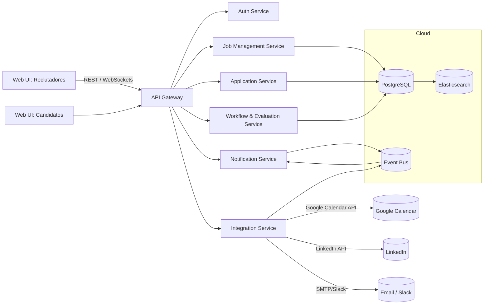
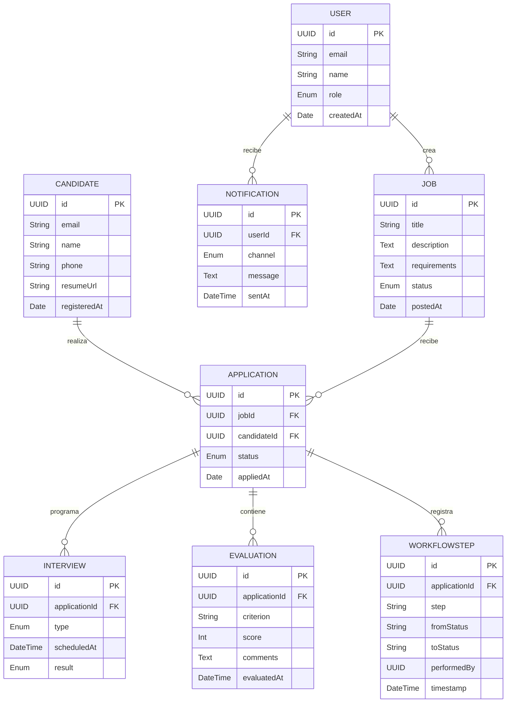
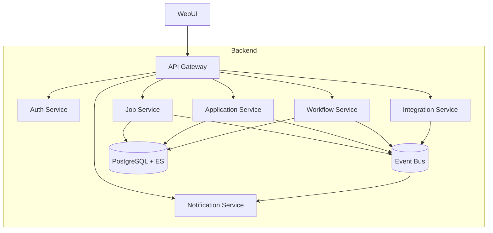

# LTI (Lean Talent Intelligence)

Sistema de seguimiento de candidatos (ATS) interno, escalable y basado en la nube, que automatiza y organiza todo el proceso de reclutamiento.

---

## 1. Descripción breve

**Valor añadido**

- Automatización integral del proceso de selección
- Publicación directa en portales externos como LinkedIn
- Gestión interna centralizada y escalable
- Historial trazable y conforme a la Ley 1581 (Colombia)

**Ventajas competitivas**

- Arquitectura modular y basada en microservicios
- Enfoque autoservicio para candidatos
- Integraciones con herramientas clave: LinkedIn, Slack, CRM, Google Calendar
- Diseño enfocado en alto rendimiento y volumen

**Funciones principales**

- Gestión de vacantes
- Recepción y clasificación de aplicaciones
- Evaluación y entrevistas técnicas/finales
- Workflows de avance de procesos
- Notificaciones multicanal (Slack, email, WebPush)
- Registro en línea de tiempo por candidato

### 1.1 Diagrama de contexto



---

## 2. Lean Canvas

| Sección                   | Contenido                                                                                                                          |
| ------------------------- | ---------------------------------------------------------------------------------------------------------------------------------- |
| **Problema**              | - Procesos de selección desintegrados y manuales<br>- Tiempo de respuesta largo<br>- Falta de trazabilidad                         |
| **Segmentos de clientes** | - Reclutadores internos<br>- Gestores de talento                                                                                   |
| **Propuesta de valor**    | ATS modular y escalable, con workflows configurables e integraciones inmediatas                                                    |
| **Solución**              | Plataforma en la nube que unifica vacantes, aplicaciones, evaluaciones y notificaciones                                            |
| **Canales**               | Web app interna, portal de candidatos, integraciones (LinkedIn, CRM)                                                               |
| **Fuentes de ingresos**   | Uso interno: asignación presupuestaria por centro de costos o unidades                                                             |
| **Estructura de costes**  | Infraestructura en la nube, desarrollo y mantenimiento continuo, licencias de APIs externas                                        |
| **Métricas clave**        | Tiempo promedio de contratación, % de automatización, volumen de vacantes procesadas, satisfacción de usuarios                     |
| **Ventaja competitiva**   | Arquitectura modular, enfoque autoservicio para candidatos, integración con herramientas clave y cumplimiento normativo colombiano |

---

## 3. Casos de uso principales

### 3.1 CU-01: Crear y publicar vacante

**Actor principal:** Reclutador
**Precondición:** Usuario autenticado con rol RECRUITER

**Flujo principal:**

1. El reclutador accede al formulario “Nueva vacante”.
2. Completa campos como título, descripción, requerimientos, tipo de contrato, salario y localización.
3. Selecciona canales de publicación (LinkedIn, portal interno).
4. Hace clic en “Publicar”.
5. El sistema guarda la vacante, la publica y emite un evento `job.published`.

```mermaid
usecaseDiagram
  actor Reclutador
  system LTI
  Reclutador --> (CU-01: Crear vacante)
  (CU-01: Crear vacante) --> (CU-02: Publicar vacante)
  (CU-02: Publicar vacante) --> LinkedIn
  (CU-02: Publicar vacante) --> PortalInterno
```

---

### 3.2 CU-02: Aplicar a vacante

**Actor principal:** Candidato
**Precondición:** Candidato registrado o invitado

**Flujo principal:**

1. El candidato navega al listado de vacantes.
2. Selecciona una vacante y hace clic en “Aplicar”.
3. Completa formulario (datos personales, CV, carta de presentación).
4. Graba o sube video de entrevista (opcional).
5. Hace clic en “Enviar”.
6. El sistema guarda la aplicación y emite un evento `application.submitted`.

```mermaid
usecaseDiagram
  actor Candidato
  system LTI
  Candidato --> (CU-03: Registrarse / Login)
  Candidato --> (CU-04: Buscar vacantes)
  Candidato --> (CU-05: Enviar aplicación)
  (CU-05: Enviar aplicación) --> DB
  (CU-05: Enviar aplicación) --> VideoSvc
```

---

### 3.3 CU-03: Avanzar candidato en workflow

**Actor principal:** Gestor de talento
**Precondición:** Gestor autenticado con rol MANAGER

**Flujo principal:**

1. El gestor accede al detalle de una aplicación.
2. Visualiza información del candidato, documentos y resultados previos.
3. Realiza evaluación técnica o funcional.
4. Decide si avanza o descarta al candidato.
5. El sistema actualiza el estado, guarda el paso en la línea de tiempo y emite un evento `workflow.updated`.

```mermaid
usecaseDiagram
  actor Gestor
  system LTI
  Gestor --> (CU-06: Ver lista de candidatos)
  Gestor --> (CU-07: Ejecutar evaluación)
  (CU-07: Ejecutar evaluación) --> EvalSvc
  Gestor --> (CU-08: Avanzar en workflow)
  (CU-08: Avanzar en workflow) --> Timeline
  Note right of Timeline: Registro de acción con timestamp
```

---

## 4. Modelo de datos



---

## 5. Diseño del sistema (alto nivel)



---

## 6. Diagrama C4 - Job Management Service

```mermaid
C4Component
  title Job Management Service – Componentes internos
  Container(API, "Job Management Service", "Node.js/Spring Boot", "CRUD vacantes y publicación externa")
  Component(Controller, "JobController", "REST Controller", "Endpoints: POST/GET/PUT /jobs")
  Component(Service, "JobService", "Lógica de negocio", "Valida datos y emite eventos")
  Component(Repo, "JobRepository", "Data Access", "Operaciones CRUD sobre tabla jobs")
  Component(Publisher, "EventPublisher", "Kafka Producer", "Publica job.created / job.published")
  Component(LinkedInClient, "LinkedInClient", "HTTP Client", "Publica en LinkedIn")
  Component(NotificationPub, "NotificationPublisher", "Event Producer", "Genera notificaciones internas")

  Rel(API, Controller, "HTTP")
  Rel(Controller, Service, "invoca")
  Rel(Service, Repo, "lee/escribe")
  Rel(Service, Publisher, "publica eventos")
  Rel(Service, LinkedInClient, "llama API")
  Rel(Service, NotificationPub, "enruta notificaciones")
  Rel(Publisher, Bus, "Kafka topic: jobs")
  Rel(NotificationPub, Bus, "Kafka topic: notifications")
```
